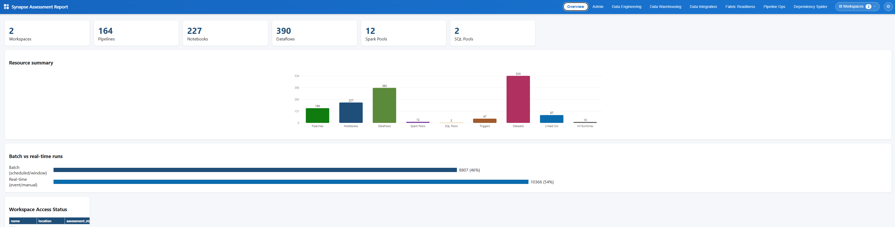
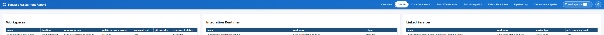
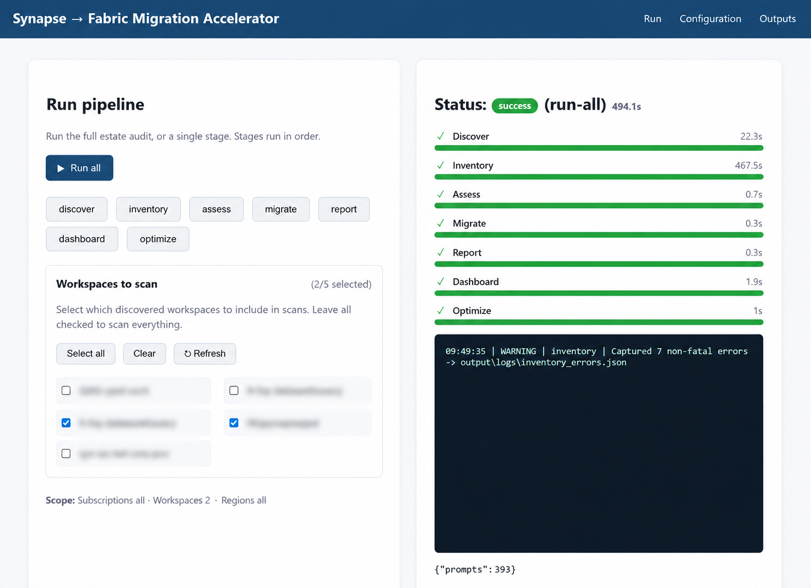
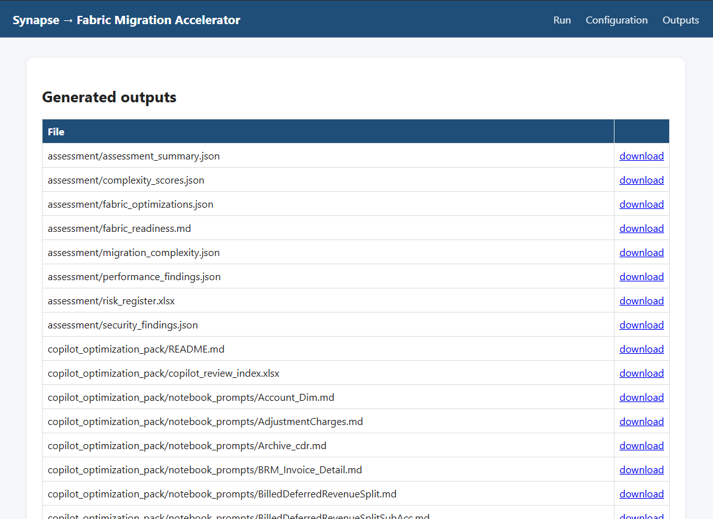
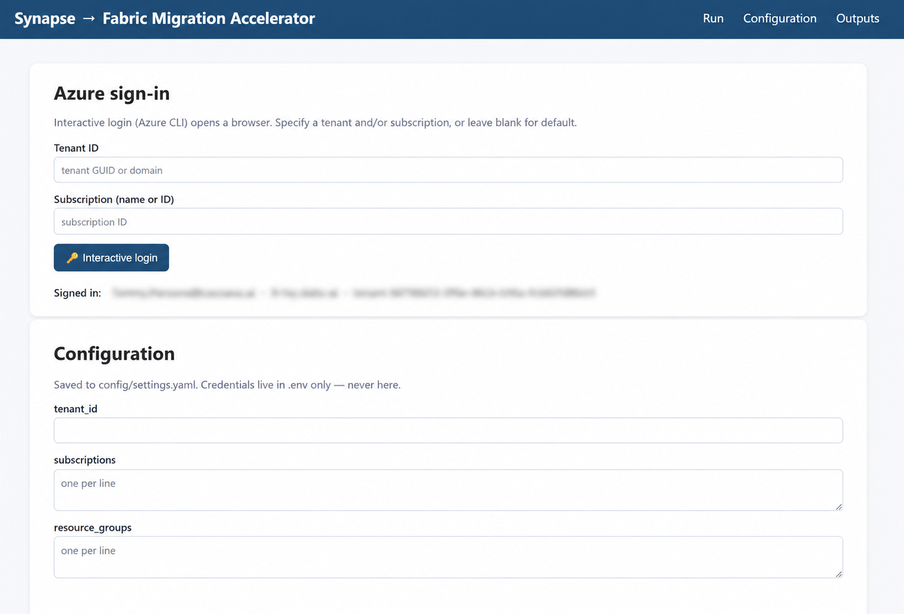

# Synapse → Fabric Migration Accelerator

Enterprise accelerator that **discovers, inventories, assesses, reports, recommends, visualizes, and prepares optimization packs** for an Azure Synapse Analytics estate so consultants can plan and execute a practical migration to **Microsoft Fabric**.

It runs read-only against your Synapse environment, produces consultant-ready deliverables (JSON, Excel, CSV, Markdown, self-contained HTML, and a Power BI project), and ships a local web UI for non-CLI users.

---

## Contents

- [What it produces](#what-it-produces)
- [Features](#features)
- [Requirements](#requirements)
- [Quick start](#quick-start)
- [CLI reference](#cli-reference)
- [Web UI](#web-ui)
- [Configuration](#configuration)
- [The seven agents](#the-seven-agents)
- [Artifact coverage](#artifact-coverage)
- [HTML dashboard](#html-dashboard)
- [Power BI](#power-bi)
- [Outputs](#outputs)
- [Required Azure access](#required-azure-access)
- [Testing & linting](#testing--linting)
- [Project layout](#project-layout)
- [Troubleshooting](#troubleshooting)

---

## What it produces

| Deliverable | Format | Audience |
|---|---|---|
| Discovery summary | JSON + Markdown | Delivery lead |
| Full estate inventory | JSON + Excel (multi-sheet) + CSV index | Architects / engineers |
| Assessment & risk register | JSON + Markdown readiness | Architects |
| Migration mapping & wave plan | JSON + Markdown + checklists | Migration team |
| Executive + technical + role reports | Markdown + HTML (13 reports) | Executives & specialists |
| Offline interactive dashboard | Self-contained HTML (no external JS) | Everyone |
| Power BI project | `.pbip` + CSV datasets + model guide | Analysts |
| Copilot optimization pack | Prompt files + index | Engineers (in VS Code) |

---

## Features

- **Discovery** across subscriptions, resource groups, and Synapse workspaces.
- **Inventory** of pipelines, **mapping & wrangling data flows**, notebooks, Spark/SQL pools, triggers, linked services, datasets, integration runtimes, storage dependencies, Git config, and **pipeline run history**.
- **Assessment** with risk/complexity scoring (Low/Medium/High/Critical), per-artifact migration effort estimates, and Fabric readiness analysis.
- **Migration** mapping to Fabric targets, a phased wave plan, and cutover / validation / decommission checklists.
- **Reports** — executive, technical, and role-aligned (admin, data engineering, data warehousing, data integration) in Markdown and HTML.
- **Offline HTML dashboard** — fully self-contained (inline SVG charts, no CDN), with workspace filtering, drill-down drawers, pipeline-flow diagrams (expandable to full screen), pipeline run analytics, a grouped **Diagrams** menu (Workspace, Trigger Dependency, Dependency, and Lineage views), and a Fabric Readiness view with a **delivery-team & timeline planner** (role head-counts + GitHub Copilot productivity uplift drive an estimated calendar duration).
- **Power BI** — a ready-to-open `.pbip` project plus CSV datasets and a model guide.
- **Copilot optimization pack** — review prompts for VS Code (no Copilot API calls are made by this tool).
- **Web UI** — configure connection, pick workspaces to scan, run any stage or the full pipeline with live logs, and browse/download every output.
- **Resilient by design** — retry with backoff, graceful partial failure, per-artifact error capture, and access-status tracking per workspace.

---

## Requirements

- **Python 3.11+**
- **Azure access** via one of: Azure CLI login (`az login`), Managed Identity, or a Service Principal.
- (Optional) ODBC Driver 18 for SQL Server — enables dedicated/serverless SQL pool table-size collection.

---

## Quick start

```powershell
py -3 -m venv .venv
.\.venv\Scripts\python.exe -m pip install -r requirements-dev.txt
Copy-Item config/settings.example.yaml config/settings.yaml
Copy-Item .env.example .env      # set AZURE_* only if using a Service Principal
.\.venv\Scripts\python.exe -m src.cli run-all
```

> On Windows, always invoke Python via `py -3` or `.\.venv\Scripts\python.exe`. A bare `python` may resolve to the Windows Store alias and fail.

To explore results immediately, launch the web UI and open the dashboard:

```powershell
.\.venv\Scripts\python.exe -m src.cli serve
# then browse http://127.0.0.1:8050  →  Dashboard
```

---

## CLI reference

```text
python -m src.cli discover     # subscriptions, resource groups, workspaces
python -m src.cli inventory    # all artifacts → JSON/Excel/CSV (+ pipeline run history)
python -m src.cli assess       # scoring, complexity, optimizations, risk register, readiness
python -m src.cli migrate      # Fabric mapping + wave plan + checklists
python -m src.cli report       # executive + technical + role reports
python -m src.cli dashboard    # offline HTML dashboard + Power BI CSVs
python -m src.cli optimize     # Copilot optimization pack
python -m src.cli run-all      # full pipeline in order
python -m src.cli serve        # launch web UI (http://127.0.0.1:8050)
```

Pass `--config path/to/settings.yaml` to any command to use an alternate configuration file.

**Re-run rules**
- Model/field changes (e.g. new artifact fields) require a fresh `inventory` run against Azure — older inventory JSON lacks new fields.
- Assessment-output changes require `assess`, then `dashboard` / `report` (these read saved JSON and need no Azure access).

---

## Web UI

```powershell
.\.venv\Scripts\python.exe -m src.cli serve   # or: python -m src.webapp
```

Open http://127.0.0.1:8050 to:

- **Configure** the Azure connection and assessment toggles (saved to `config/settings.yaml`).
- **Pick workspaces to scan** — a checkbox grid populated from discovery; leaving all selected scans everything.
- **Run** any single stage or the full pipeline with **live progress bars and logs** per agent.
- **Browse and download** every generated output, including the dashboard.

Credentials stay in `.env`; the UI never stores secrets.

---

## Configuration

Edit `config/settings.yaml` (copied from `config/settings.example.yaml`). Highlights:

| Key | Purpose |
|---|---|
| `subscription_ids` | Limit discovery to specific subscriptions (empty = all accessible). |
| `resource_group_names` | Limit to specific resource groups (empty = all). |
| `workspace_names` | Limit to specific Synapse workspaces (empty = all). |
| `output_dir` | Root for all generated artifacts. |
| `pipeline_run_history_days` | Look-back window for pipeline run analytics. |
| `collect_sql_sizes` | Enable DMV-based SQL pool table sizing (needs ODBC + access). |

Secrets are **never** stored in YAML. Service Principal credentials come from `.env`:

```
AZURE_TENANT_ID=...
AZURE_CLIENT_ID=...
AZURE_CLIENT_SECRET=...
```

Empty filter lists mean "discover everything accessible".

---

## The seven agents

The pipeline is seven specialized agents that run in order. Each reads only the inputs it needs, writes to its own output folder, and continues on partial failure.

| # | Agent | Reads | Writes |
|---|---|---|---|
| 1 | **Discovery** | Azure subscriptions | `output/discovery/` |
| 2 | **Inventory** | workspaces (data-plane REST + SQL DMVs) | `output/inventory/` |
| 3 | **Assessment** | inventory | `output/assessment/` |
| 4 | **Migration** | inventory + assessment | `output/migration/` |
| 5 | **Reporting** | inventory + assessment + migration | `output/reports/` |
| 6 | **Dashboard** | all of the above | `output/dashboard/` + `powerbi/*.csv` |
| 7 | **Optimization** | inventory + assessment | `output/copilot_optimization_pack/` |

See [`src/agents/README.md`](src/agents/README.md) for per-agent detail and [`docs/architecture.md`](docs/architecture.md) for the end-to-end design.

---

## Artifact coverage

The inventory and assessment cover:

- **Pipelines** — activity graph, nested activities, parameters, dataset/linked-service references, and **run history** (success rate, reruns, batch vs. real-time, durations).
- **Mapping & Wrangling Data Flows** — sources, sinks, transformations (join, lookup, aggregate, window, pivot, surrogate key, …), parameters, and dataset/linked-service references; assessed and mapped to **Dataflow Gen2**.
- **Notebooks** — language, cell count, Spark/Delta/MSSparkUtils/Spark-config usage, secret detection, and a code preview.
- **Spark pools** — node size/count, autoscale, auto-pause, Spark version.
- **SQL pools** — dedicated/serverless, SKU/tier, table counts and sizes (best-effort via DMVs).
- **Triggers** — schedule/tumbling-window/storage-event/custom-event/manual, recurrence, state, pipeline coupling.
- **Linked services, datasets, integration runtimes, storage dependencies, and Git configuration.**

---

## HTML dashboard

`output/dashboard/index.html` is fully self-contained (inline SVG, no external scripts) and includes:

- **Overview** — KPI cards and a resource-summary chart (incl. data flows), plus batch vs. real-time split.
- **Admin / Data Engineering / Data Warehousing / Data Integration** — role-aligned tables (data flows appear under Integration and Data Engineering).
- **Pipeline Ops** — pipeline run analytics with a runs-by-day line chart, status breakdown, and click-to-filter per-pipeline statistics.
- **Fabric Readiness** — migration-complexity bands, per-type complexity tables (pipelines, notebooks, **data flows**), and Fabric optimization opportunities. Includes a **delivery-team & timeline planner**: enter head-counts per role (architects, data engineers, data-integration engineers, infra engineers, QA) and pick a **GitHub Copilot** productivity tier to convert the total person-day rebuild effort into an estimated calendar duration. Clicking a complexity band filters the KPI cards, effort, optimizations, planner, and tables to that band; click again to clear.
- **Diagrams** (grouped dropdown) — four dependency visualizations:
  - **Workspace Diagram** — per-workspace artifact distribution (incl. data flows).
  - **Trigger Dependency Diagram** — follows each trigger to the pipelines it fires, then on to the notebooks and data flows those pipelines run (tracing `ExecutePipeline` chains and nested container activities), exposing the schedule/event-driven dependency chains you must re-wire in Fabric.
  - **Dependency Diagram** — the inverse view, tracing notebooks and data flows back through their pipelines to the triggers that fire them; orphaned artifacts (no pipeline or no trigger) are shown so nothing is missed, with a toggle to hide unlinked items.
  - **Lineage** — a searchable, type-filterable table of every artifact with its upstream and downstream references; each reference is clickable to open that item's details.
- **Drill-down drawer** — click any row for details: pipeline activity-flow diagrams (with a full-screen **Expand** view, closable via button or Escape), notebook code, complexity drivers + optimizations, and data-flow source/sink/transformation breakdowns.

A shared workspace filter applies across every view.

### Fabric Readiness — delivery-team & timeline planner


Enter head-counts per role and pick a **GitHub Copilot** productivity tier to convert the total person-day rebuild effort into an estimated calendar duration. Clicking a complexity band re-scopes the KPI cards, effort, optimizations, planner, and tables to that band.

### Overview



### Pipeline Ops


### Role-aligned views

| Admin | Data Engineering | Data Warehousing | Data Integration |
|---|---|---|---|
|  |  |  |  |

### Web UI

| Run pipeline | Generated outputs |
|---|---|
|  |  |



---

## Power BI

- `powerbi/SynapseMigration.pbip` — open in Power BI Desktop.
- CSV datasets — `workspaces`, `pipelines`, `pipeline_activities`, `pipeline_run_stats`, `notebooks`, `dataflows`, `spark_pools`, `sql_pools`, `linked_services`, `datasets`, `security_findings`, `migration_complexity`, `fabric_recommendations`, `fabric_optimizations`, and more.
- `powerbi/PowerBI_Model_Guide.md` — relationships and modeling guidance.

> CSV headers must match the model's expected columns exactly, or visuals show no data. Regenerate via `python -m src.cli dashboard`.

---

## Outputs

| Folder | Contents |
|---|---|
| `output/discovery/` | subscriptions, resource groups, workspaces, summary |
| `output/inventory/` | inventory JSON/Excel, artifact index, dependency map |
| `output/assessment/` | scores, complexity, optimizations, risk register, readiness, findings |
| `output/migration/` | mapping, recommendations, wave plan, cutover/validation/decommission checklists |
| `output/reports/` | executive + technical + role reports (MD/HTML) |
| `output/dashboard/` | offline HTML dashboard |
| `output/copilot_optimization_pack/` | review prompts + index |
| `powerbi/` | `.pbip` project, CSV datasets, model guide |
| `output/logs/` | per-agent logs + error JSON |

`output/` and `powerbi/*.csv` are git-ignored (generated artifacts).

---

## Required Azure access

Read-only roles are sufficient for most data:

- **Reader** on subscriptions / resource groups (discovery, control-plane inventory).
- **Synapse Artifact User / Reader** (or workspace RBAC) for data-plane artifacts (pipelines, notebooks, data flows, datasets, linked services, triggers).
- **Synapse Monitoring Operator** to read **pipeline run history** (otherwise Pipeline Ops shows no runs and the workspace is marked partially accessible).
- SQL pool sizing additionally needs network reachability and a SQL login/permission plus ODBC Driver 18.

Workspaces that are unreachable or lack permissions are recorded with an access status and per-artifact error notes rather than failing the run. See [`docs/SYNAPSE_ACCESS_REQUEST.md`](docs/SYNAPSE_ACCESS_REQUEST.md).

---

## Testing & linting

```powershell
.\.venv\Scripts\python.exe -m pytest -q
.\.venv\Scripts\python.exe -m ruff check src tests
```

---

## Project layout

```
src/
  cli.py            # command-line entry point
  agents/           # the 7 pipeline agents  (see src/agents/README.md)
  models/           # Pydantic models + enums + scoring helpers
  services/         # Azure auth, ARM clients, Synapse data-plane REST
  exporters/        # JSON / CSV / Excel / Markdown / Power BI (.pbip) writers
  templates/        # self-contained HTML dashboard template
  utils/            # config, logging, retry, scoring
  webapp/           # Flask web UI (app, auth, background jobs)
config/             # settings.example.yaml (+ your settings.yaml)
docs/               # architecture + access-request guidance
tests/              # pytest suite + fixtures
```

See [`src/README.md`](src/README.md) for a module-level tour.

---

## Troubleshooting

- **Pipeline Ops empty** — the workspace lacks *Synapse Monitoring Operator*, or the data plane is unreachable (firewall/Private Link). Re-run `inventory` after granting access.
- **Dashboard looks stale** — the web server caches loaded code; restart `serve` after regenerating, and hard-refresh the browser (Ctrl+F5).
- **Data-flow / new-field tables empty** — saved inventory predates the field; run a live `inventory` to populate.
- **`python` not found** — use `py -3` or `.\.venv\Scripts\python.exe`.

---

## Development principles

Python 3.11+, modular agents, type hints, structured logging, retry with backoff, graceful partial failure, **no secrets in code**, Azure Identity, Azure SDK first (REST where the SDK is thin), tests, and consultant-ready outputs.
